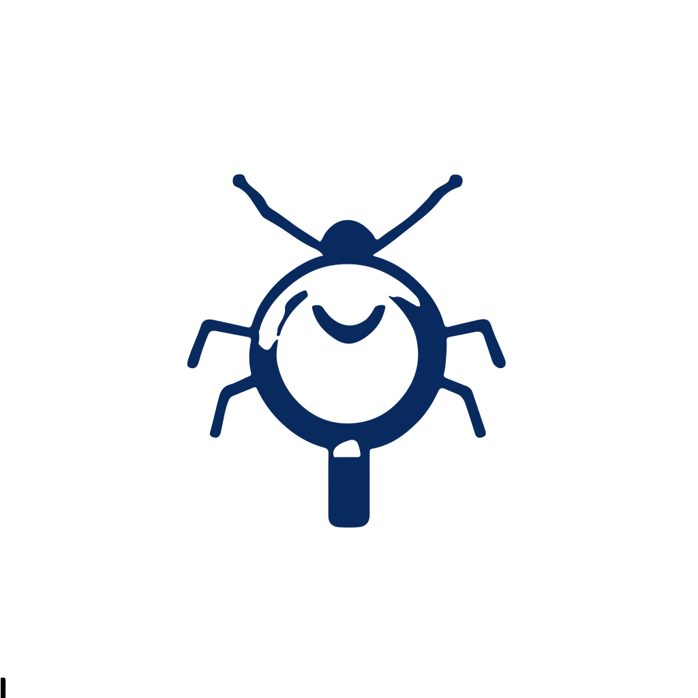
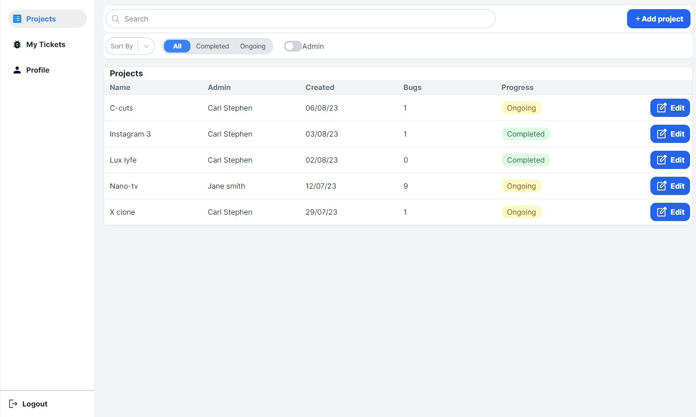

<!--
Hey, thanks for using the awesome-readme-template template.
If you have any enhancements, then fork this project and create a pull request
or just open an issue with the label "enhancement".

Don't forget to give this project a star for additional support ;)
Maybe you can mention me or this repo in the acknowledgements too
-->
<div align="center">

  
  <h1>Bug Spy</h1>
  
  <p>
    Spy, resolve and track bugs in your projects.
  </p>
  
  
<!-- Badges -->
<p>
  <a href="https://github.com/Yagi91/Bug-spy/graphs/contributors">
    
  </a>
  <a href="">
    
  </a>
  <a href="https://github.com/Yagi91/Bug-spy/network/members">
    
  </a>
  <a href="https://github.com/Yagi91/Bug-spy/stargazers">
    
  </a>
  <a href="https://github.com/Yagi91/Bug-spy/issues/">
    
  </a>
  <a href="https://github.com/Yagi91/Bug-spy/blob/master/LICENSE">
    
  </a>
</p>
   
<h4>
    <a href="https://bug-spy.vercel.app/">View Demo</a>
  <span> · </span>
    <a href="https://github.com/Louis3797/awesome-readme-template">Documentation</a>
  <span> · </span>
    <a href="https://github.com/Louis3797/awesome-readme-template/issues/">Report Bug</a>
  <span> · </span>
    <a href="https://github.com/Louis3797/awesome-readme-template/issues/">Request Feature</a>
  </h4>
</div>

<br />

<!-- Table of Contents -->

# :notebook_with_decorative_cover: Table of Contents

- [About the Project](#star2-about-the-project)
  - [Screenshots](#camera-screenshots)
  - [Tech Stack](#space_invader-tech-stack)
  - [Features](#dart-features)
  - [Color Reference](#art-color-reference)
  - [Environment Variables](#key-environment-variables)
- [Getting Started](#toolbox-getting-started)
  - [Prerequisites](#bangbang-prerequisites)
  - [Installation](#gear-installation)
  - [Running Tests](#test_tube-running-tests)
  - [Run Locally](#running-run-locally)
  - [Deployment](#triangular_flag_on_post-deployment)
- [Usage](#eyes-usage)
- [Roadmap](#compass-roadmap)
- [Contributing](#wave-contributing)
  - [Code of Conduct](#scroll-code-of-conduct)
- [FAQ](#grey_question-faq)
- [License](#warning-license)
- [Contact](#handshake-contact)
- [Acknowledgements](#gem-acknowledgements)

<!-- About the Project -->

## :star2: About the Project

<!-- Screenshots -->

### :camera: Screenshots

<div align="center"> 
  
</div>

<!-- TechStack -->

### :space_invader: Tech Stack

<details>
  <summary>Client</summary>
  <ul>
    <li><a href="https://www.typescriptlang.org/">Typescript</a></li>
    <li><a href="https://redux-toolkit.js.org/">Redux-Toolkit</a></li>
    <li><a href="https://reactjs.org/">React.js</a></li>
    <li><a href="https://tailwindcss.com/">TailwindCSS</a></li>
  </ul>
</details>

<details>
  <summary>Server</summary>
  <ul>
    <li><a href="https://developer.mozilla.org/en-US/docs/Web/JavaScript">JavaScript</a></li>
    <li><a href="https://expressjs.com/">Express.js</a></li>
    <li><a href="https://nodejs.org/en">Node.js</a></li>
    <li><a href="https://socket.io/">SocketIO</a></li>
    <li><a href="https://mongoosejs.com/">Mongoose</a></li>
  </ul>
</details>

<details>
<summary>Database</summary>
  <ul>
    <li><a href="https://www.mongodb.com/">MongoDB</a></li>
    <li><a href="https://redis.io/">Redis</a></li>
  </ul>
</details>

<details>
<summary>DevOps</summary>
  <ul>
    <li><a href="https://www.docker.com/">Docker</a></li>
    <li><a href="https://cloud.google.com/appengine">Google App Engine</a></li>
    <li><a href="https://www.nginx.com/">NginX</a></li>
  </ul>
</details>

<!-- Features -->

### :dart: Features

- Users can create a Project
- Users can create a Bug
- Users can assign a Bug to a Project
- Users can assign a Bug to a User
- Users can Track the progress of a Bug

<!-- Color Reference -->

### :art: Color Reference

| Color           | Hex                                                              |
| --------------- | ---------------------------------------------------------------- |
| Primary Color   |  #EEEEEE |
| Secondary Color |  #2196F3 |
| Accent Color    |  #393E46 |
| Text Color      |  #222831 |
|                 |

<!-- Env Variables -->

### :key: Environment Variables

To run this project, you will need to add the following environment variables to your .env file

`API_KEY`
https://bug-spy-server.ew.r.appspot.com
`ANOTHER_API_KEY`

<!-- Getting Started -->

## :toolbox: Getting Started

<!-- Prerequisites -->

### :bangbang: Prerequisites

This project uses NPM as package manager

```bash
 Preinstalled with Node.js
```

<!-- Installation -->

### :gear: Installation

Install my-project with npm

```bash
  npm install bug-spy
  cd bug-spy
```

<!-- Running Tests -->

### :test_tube: Running Tests

To run tests, run the following command

```bash
  Coming Soon!
```

<!-- Run Locally -->

### :running: Run Locally

Clone the project

```bash
  git clone https://github.com/Yagi91/Bug-spy.git
```

Go to the project directory

```bash
  cd bug-spy
```

Install dependencies

```bash
  npm install
```

Start the server

Runs the app in the development mode.\
Open [http://localhost:3000](http://localhost:3000) to view it in the browser.

```bash
  npm start
```

<!-- Deployment -->

### :triangular_flag_on_post: Deployment

To deploy this project to Github-pages run

```bash
  npm  run deploy
```

<!-- Usage -->

## :eyes: Usage

<!-- Use this space to tell a little more about your project and how it can be used. Show additional screenshots, code samples, demos or link to other resources. -->

Bug Spy is a bug tracking application that allows users to create projects and add bugs to them. Users can also assign bugs to other users and see the status of the bug. User roles are also implemented to allow for different levels of access to projects.
The projects page is well organized and allows users to easily see the status of their projects, filter projects by status, and search for projects by name.

-The project page also allows users to create new projects and delete projects they have created.

- The project details page allows users to see all the bugs in a project and their status. Users can also create new bugs and delete bugs they have created.

- Members of a project can be added and removed from the project details page. Users can also change the role of members of a project.

- The list of bugs of a project is found on the project details page. Users can see all the bugs in a project and their status. Users can also create new bugs and delete bugs they have created.

- Each Bug can be assigned to a user and the status of the bug can be changed. The bug details page also allows users to add comments to the bug and delete comments they have created.

- My tickets page allows the user to see all the bugs the have been assigned to. Thi will enable the user to easily work on a task that has been assigned to them. The user can also navigate to the bug details page from the my tickets page.

- The profile page allows the user to see their details and update their details. The user can also change their email, role, language, and Timezone.

- _The application's chat feature is coming soon!_

**Screenshots of the application can be found below.**

<div align="center"> 
  
  
  
  
  
  
  
  
  
  
  
</div>

```javascript
//Used React-select to create a dropdown menu for the user roles and other select inputs
import Select from "react-select";

const options = [
  { value: "chocolate", label: "Chocolate" },
  { value: "strawberry", label: "Strawberry" },
  { value: "vanilla", label: "Vanilla" },
];

const handleChange = (e) => {
  console.log(e.value);
};

<Select options={options} onChange={handleChange} defaultValue={options[0]} />;

//Used react-router-dom to create the routes for the application

import { BrowserRouter as Router, Switch, Route } from "react-router-dom";

<Router>
  <Switch>
    <Route path="/" exact component={Home} />
    <Route path="/about" component={About} />
    <Route path="/projects" component={Projects} />
  </Switch>
</Router>;

//Created custom UseTitle hook to change the title of the page

import { useTitle } from "../features/common/customHooks";

const App = () => {
  useTitle("Bug Spy");
  return (
    <div>
      <h1>My App</h1>
    </div>
  );
};
```

<!-- Roadmap -->

## :compass: Roadmap

- [x] Create Authentication
- [x] Create Projects
- [x] Create Bugs
- [x] Create User Roles
- [x] Project Details Page
- [x] Project Page
- [x] User Page
- [ ] Chat Feature

<!-- Contributing -->

## :wave: Contributing

<a href="https://github.com/Louis3797/awesome-readme-template/graphs/contributors">
  
</a>

Contributions are always welcome!

See `contributing.md` for ways to get started.

<!-- Code of Conduct -->

### :scroll: Code of Conduct

Please read the [Code of Conduct](https://github.com/Louis3797/awesome-readme-template/blob/master/CODE_OF_CONDUCT.md)

<!-- FAQ -->

## :grey_question: FAQ

- **How do I do _quickly edit bugs_?**

  - First, login to your account. From the projects dashboard, click on the edit icon at found at the side of the bug you want to edt. You will then see a popup that will allow you to edit the bug.

    _Note: This is only available on desktop._

<!-- License -->

## :warning: License

Distributed under the MIT License. See LICENSE.txt for more information.

<!-- Contact -->

## :handshake: Contact

Bryan Timah - [LinkedIn](https://www.linkedin.com/in/bryan-timah/) - bryantimah@gmail

Project Links:

- [Front-End](https://github.com/Yagi91/Bug-spy)
- [Back-End](https://github.com/Yagi91/bug-spy-BackEnd)

<!-- Acknowledgments -->

## :gem: Acknowledgements

<!-- Use this section to mention useful resources and libraries that you have used in your projects. -->

- [React Select](https://react-select.com/)
- [Awesome README](https://github.com/matiassingers/awesome-readme)
- [tailwind components](https://tailwindcomponents.com/)
